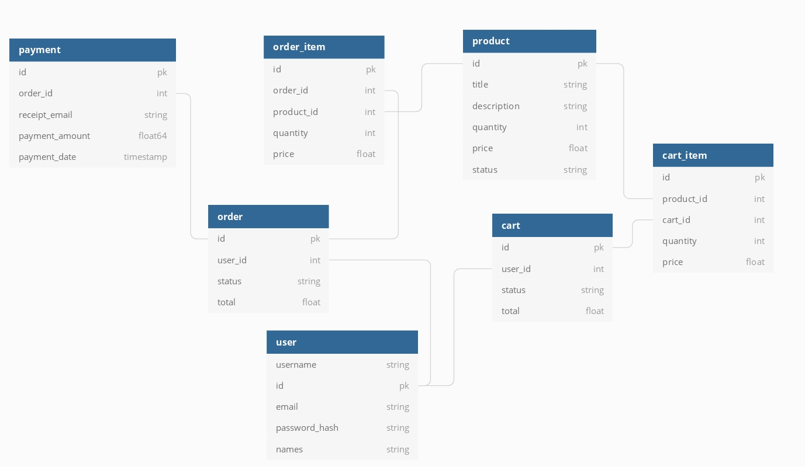

# General-purpose music downloading service
## To-do
* Provide authorization and authentication.
* Refactor to reduce inconsistencies.
* Add more validation.
## ER Diagram

## API endpoints
### User
* GET /user/:id
* PATCH /user/:id
* POST /user/
* DELETE /user/:id
### Product
* GET /products
* GET /product/:id
* PATCH /product/:id
* POST /product
* DELETE /product/:id
### Cart
* POST /cart Create a new cart
* PATCH /cart/:id Put a product in the cart
* GET /cart/:id Get a cart's contents
* POST /cart/:id/checkout Take an order
### Order
* GET /orders
* GET /order/:id
* POST /order/:id/pay