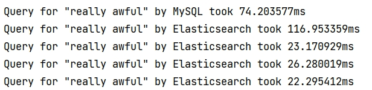
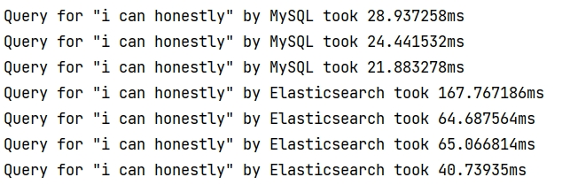
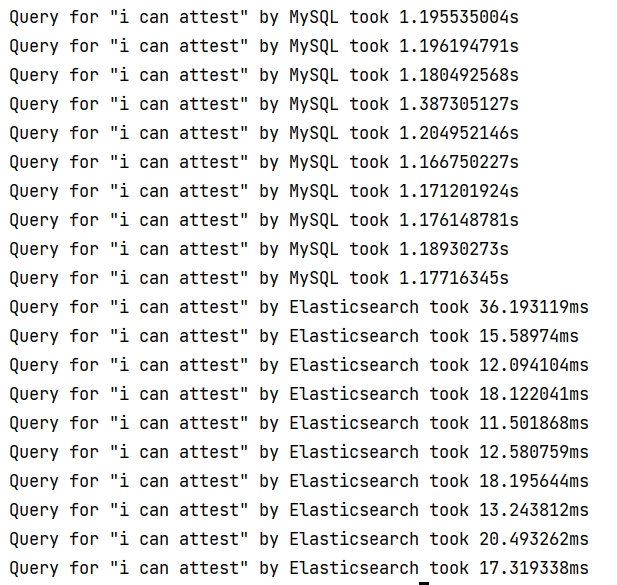

# Overview
## MySQL vs. ElasticSearch querying performance comparison
* For the sake of brevity, only 3 phrases were tested. Since we were going to compare the performance between MySQL's **LIKE** with an Elasticsearch's equivalence, it's only fair to use **match_phrase** since this query requires a response to contain [exactly](https://stackoverflow.com/questions/26001002/elasticsearch-difference-between-term-match-phrase-and-query-string) the original phrase.
* For the phrase "really awful", MySQL seemed to be faster than ES at first but ES quickly caught up and overcame MySQL at subsequence searches. Let's see if MySQL can do the same thing as ES in the next example.

* Here ES was actually slower than MySQL. It should be noted that ES's speed for the same query eventually matched that of MySQL (which isn't shown here). So MySQL's querying speed is decreasing as well, can it keep up with a different query?

* Unfortunately, there's not much of a difference between various MySQL's querying speeds here. Moreover, ES trumped MySQL by a large margin from the outset.

### Conclusion
* Rerun on the same phrase ended up with a much faster time for ES probably due to automatic caching. Roughly speaking, the more frequently a search term is used, the less time ES will take to return a response, although we can see in the second example that this is not true.
* MySQL does seem to speed up witch each succeeding run on the same query.
Does that mean MySQL caches previous search results? The answer seems to be a resounding [yes](https://docs.oracle.com/cd/E17952_01/mysql-5.1-en/query-cache.html).
* Another question remains, do both MySQL and ES persist caching queries?
* ES's other powerful searching features weren't explored here. For example,
ES can search for part of the query, meaning that as long as the source contains some token from the query, ES will return a non-null response.
* There's some discrepancy between how go's *Time* measures the elapsed time in comparison with elastic's built-in *TookInMillis*. Might totally have been due to own poor implementation, however.
## CRUD against database *people*
### ER diagram

### CRUD Operations
* GET /people
* GET /person/:id
* POST /person
* PUT /person/:id
* DELETE /person/:id